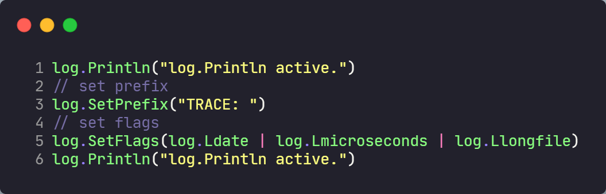
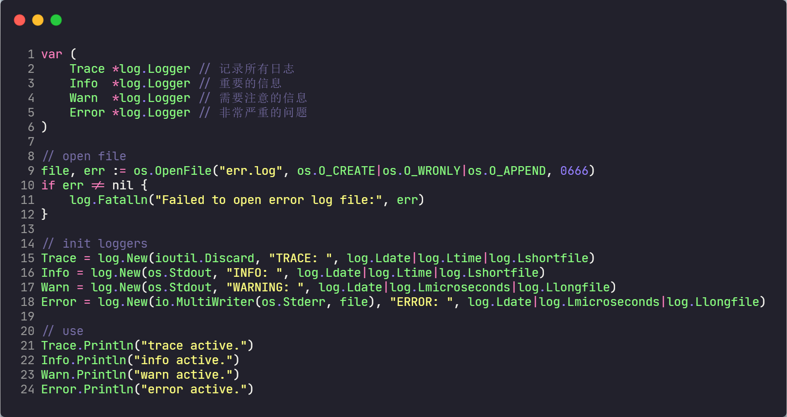
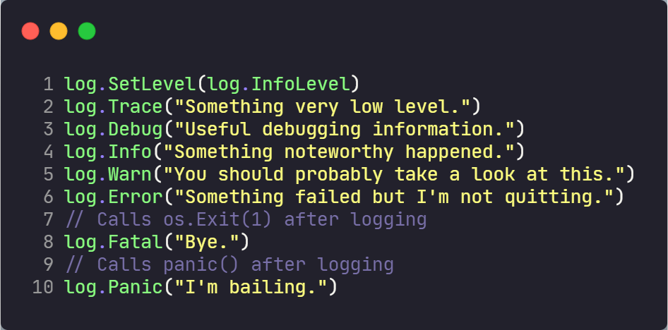
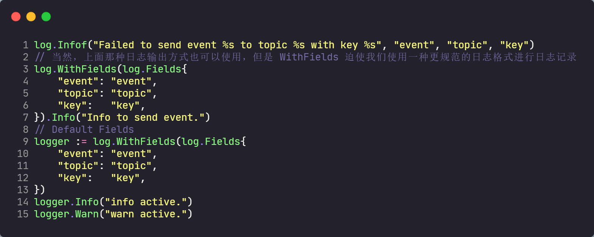
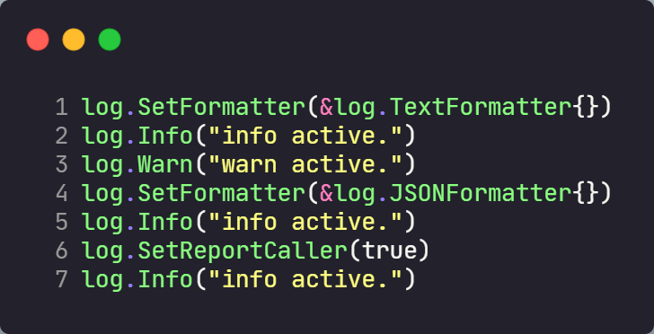
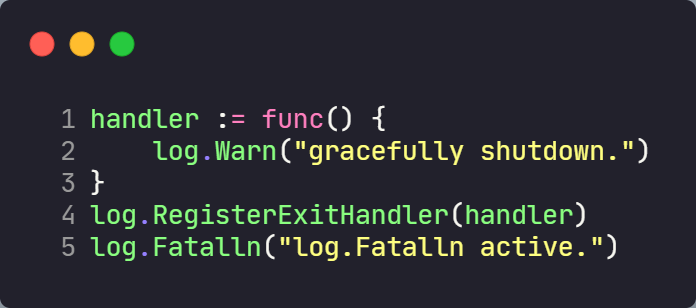
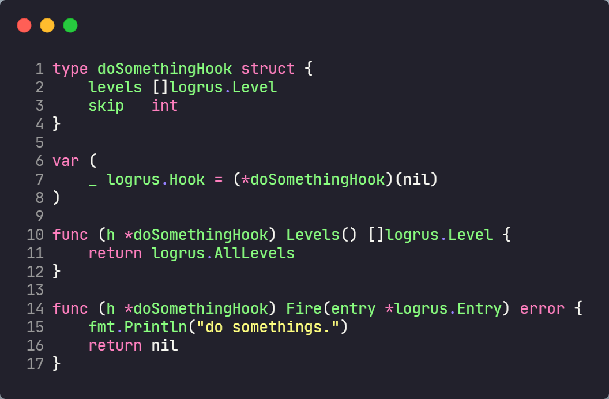
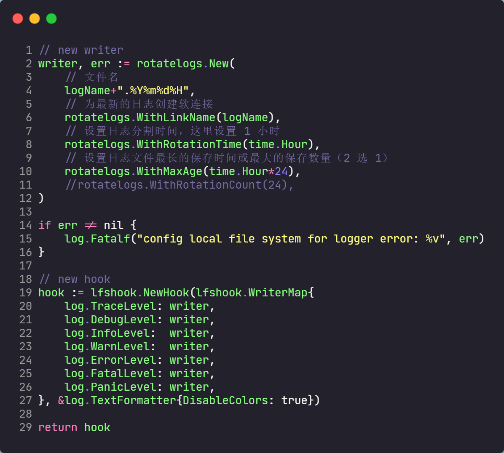
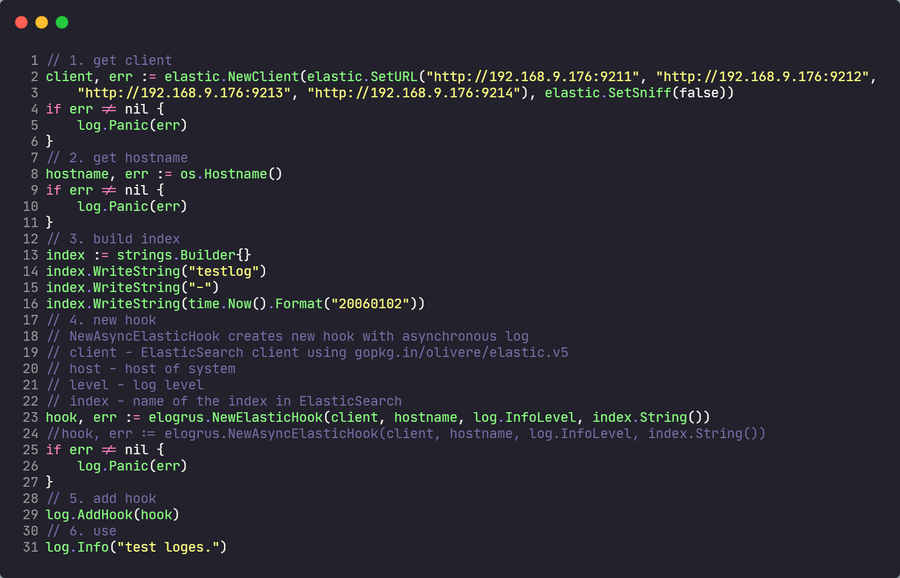

# go-log

## log(https://pkg.go.dev/log)

### 1. 最基本的使用

### 2. 额外功能

### 3. 定制不同的 log 实现

`log 包的实现是基于对记录日志这个需求长时间的时间和积累而形成的。
标准库的 log 包包含了记录日志需要的所有功能，我们可以完全信任这个
包的实现，不仅仅是因为它是标准库的一部分，而且社区也广泛使用它。`

## logrus(https://github.com/sirupsen/logrus)

logrus 是一个与标准库 API 完全兼容的日志包。

目前处于维护状态，不再增加新的功能，只处理漏洞和性能问题。

### 1. Level Logging

logrus 提供了 7 种常见的日志等级(Trace、Debug、Info、Warning、Error、Fatal、Panic)

### 2. Fields

logrus 鼓励使用日志字段替代无法解析的长文本来结构化记录日志。

这样会有 2 个好处：

1. 规范日志结构（而非一长串非结构化文本）
2. 定义一次后可以到处使用

### 3. Formatters

1. 文件名、函数名、行号
2. 时间戳、颜色
3. ...

### 4. Fatal Handler

### 5. Hook

### 6. 其它

* Testings
* Thread safety
* ...

## loges

ELK(ElasticSearch + Logstash + Kibana)
EFK(ElasticSearch + Filebeat + Kibana)

logrus 已经实现了各类的 hook，可以将 log 格式化输入到 es、logstash、InfluxDB、redis。

## Others

* benchmark

| log 方式 | 次数 | 平均速率 |
| :---: | :---: | :---: | 
| log | 43206 | 27802 ns/op |
| logrus | 37167 | 33479 ns/op |
| loges | 3696 | 2636881 ns/op |
